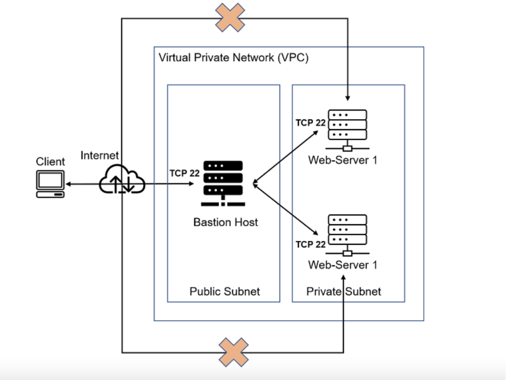

## ANSIBLE CONFIGURATION MANAGEMENT – AUTOMATE PROJECT 7 TO 10

You have been implementing some interesting projects up untill now, and that is awesome.

In Projects 7 to 10 you had to perform a lot of manual operations to seet up virtual servers, install and configure required software, deploy your web application.

This Project will make you appreciate DevOps tools even more by making most of the routine tasks automated with [Ansible Configuration Management](https://www.redhat.com/en/topics/automation/what-is-configuration-management#:~:text=Configuration%20management%20is%20a%20process,in%20a%20desired%2C%20consistent%20state.&text=Managing%20IT%20system%20configurations%20involves,building%20and%20maintaining%20those%20systems.), at the same time you will become confident at writing code using declarative language such as [YAML.](https://en.wikipedia.org/wiki/YAML)

### Ansible Client as a Jump Server (Bastion Host)

A [Jump Server](https://en.wikipedia.org/wiki/Jump_server) (sometimes also referred as [Bastion Host](https://en.wikipedia.org/wiki/Bastion_host)) is an intermediary server through which access to internal network can be provided. If you think about the current architecture you are working on, ideally, the webservers would be inside a secured network which cannot be reached directly from the Internet. That means, even DevOps engineers cannot SSH into the Web servers directly and can only access it through a Jump Server – it provide better security and reduces [attack surface](https://en.wikipedia.org/wiki/Attack_surface).

On the diagram below the Virtual Private Network (VPC) is divided into [two subnets](https://docs.aws.amazon.com/vpc/latest/userguide/how-it-works.html) – Public subnet has public IP addresses and Private subnet is only reachable by private IP addresses.

