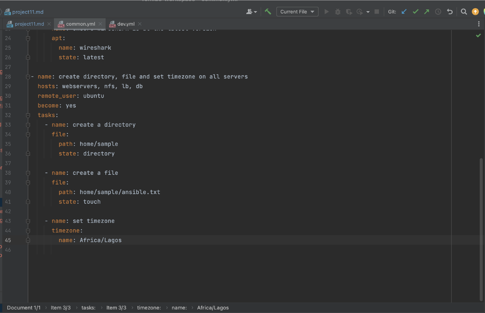

## ANSIBLE CONFIGURATION MANAGEMENT – AUTOMATE PROJECT 7 TO 10

You have been implementing some interesting projects up untill now, and that is awesome.

In Projects 7 to 10 you had to perform a lot of manual operations to seet up virtual servers, install and configure required software, deploy your web application.

This Project will make you appreciate DevOps tools even more by making most of the routine tasks automated with [Ansible Configuration Management](https://www.redhat.com/en/topics/automation/what-is-configuration-management#:~:text=Configuration%20management%20is%20a%20process,in%20a%20desired%2C%20consistent%20state.&text=Managing%20IT%20system%20configurations%20involves,building%20and%20maintaining%20those%20systems.), at the same time you will become confident at writing code using declarative language such as [YAML.](https://en.wikipedia.org/wiki/YAML)


### Ansible Client as a Jump Server (Bastion Host)

A [Jump Server](https://en.wikipedia.org/wiki/Jump_server) (sometimes also referred as [Bastion Host](https://en.wikipedia.org/wiki/Bastion_host)) is an intermediary server through which access to internal network can be provided. If you think about the current architecture you are working on, ideally, the webservers would be inside a secured network which cannot be reached directly from the Internet. That means, even DevOps engineers cannot SSH into the Web servers directly and can only access it through a Jump Server – it provide better security and reduces [attack surface](https://en.wikipedia.org/wiki/Attack_surface).

On the diagram below the Virtual Private Network (VPC) is divided into [two subnets](https://docs.aws.amazon.com/vpc/latest/userguide/how-it-works.html) – Public subnet has public IP addresses and Private subnet is only reachable by private IP addresses.


When you reach Project 15, you will see a Bastion host in proper action. But for now, we will develop **Ansible** scripts to simulate the use of a <mark>Jump box/Bastion host</mark> to access our Web Servers.

Task
- Install and configure Ansible client to act as a Jump Server/Bastion Host.
- Create a simple Ansible playbook to automate servers configuration.

### INSTALL AND CONFIGURE ANSIBLE ON EC2 INSTANCE
1. Update <mark>Name</mark> tag on your <mark>Jenkins</mark> EC2 Instance to <mark>Jenkins-Ansible.</mark> We will use this server to run playbooks.
2. In your GitHub account create a new repository and name it <mark>ansible-config-mgt.</mark>

3. Install Ansible

``
sudo apt update
sudo apt install ansible
``
Check your Ansible version by running ansible <mark>--version</mark>


4. Configure Jenkins build job to save your repository content every time you change it – this will solidify your Jenkins configuration skills acquired in Project 9.
- Create a new Freestyle project <mark>ansible</mark> in Jenkins and point it to your ‘ansible-config-mgt’ repository.
- Configure Webhook in GitHub and set webhook to trigger <mark>ansible</mark> build.
- Configure a Post-build job to save all (<mark>**</mark>) files, like you did it in Project 9.

5. Test your setup by making some change in README.MD file in <mark>master</mark> branch and make sure that builds starts automatically and Jenkins saves the files (build artifacts) in following folder

`ls /var/lib/jenkins/jobs/ansible/builds/<build_number>/archive/`


Note: Trigger Jenkins project execution only for /main (master) branch.

Now your setup will look like this:


Tip Every time you stop/start your <mark>Jenkins-Ansible</mark> server – you have to reconfigure GitHub webhook to a new IP address, in order to avoid it, it makes sense to allocate an [Elastic IP](https://docs.aws.amazon.com/AWSEC2/latest/UserGuide/elastic-ip-addresses-eip.html) to your <mark>Jenkins-Ansible</mark>) server (you have done it before to your LB server in Project 10). Note that Elastic IP is free only when it is being allocated to an EC2 Instance, so do not forget to release Elastic IP once you terminate your EC2 Instance.

#### Step 2 – Prepare your development environment using Visual Studio Code

First part of ‘DevOps’ is ‘Dev’, which means you will require to write some codes and you shall have proper tools that will make your coding and debugging comfortable – you need an [Integrated development environment (IDE)](https://en.wikipedia.org/wiki/Integrated_development_environment) or [Source-code Editor.](https://en.wikipedia.org/wiki/Source-code_editor) There is a plethora of different IDEs and Source-code Editors for different languages with their own advantages and drawbacks, you can choose whichever you are comfortable with, but we recommend one free and universal editor that will fully satisfy your needs – [Visual Studio Code (VSC)](https://en.wikipedia.org/wiki/Visual_Studio_Code), you can get it [here](https://code.visualstudio.com/download).
After you have successfully installed VSC, configure it to connect to your newly created GitHub repository.
Clone down your ansible-config-mgt repo to your Jenkins-Ansible instance

`git clone <ansible-config-mgt repo link>`


## BEGIN ANSIBLE DEVELOPMENT

1. In your <mark>ansible-config-mgt</mark> GitHub repository, create a new branch that will be used for development of a new feature.
Tip: Give your branches descriptive and comprehensive names, for example, if you use [Jira](https://www.atlassian.com/software/jira) or [Trello](https://trello.com) as a project management tool – include ticket number (e.g. <mark>PRJ-145</mark>) in the name of your branch and add a topic and a brief description what this branch is about – a <mark>bugfix, hotfix, feature, release</mark> (e.g. <mark>feature/prj-145-lvm(/mark))

2. Checkout the newly created feature branch to your local machine and start building your code and directory structure
3. Create a directory and name it <mark>playbooks</mark> – it will be used to store all your playbook files.
4. Create a directory and name it <mark>inventory</mark> – it will be used to keep your hosts organised.
5. Within the playbooks folder, create your first playbook, and name it <mark>common.yml</mark>
6. Within the inventory folder, create an inventory file (.yml) for each environment (Development, Staging Testing and Production) <mark>dev, staging, uat, and prod</mark> respectively.


### Step 4 – Set up an Ansible Inventory

An Ansible inventory file defines the hosts and groups of hosts upon which commands, modules, and tasks in a playbook operate. Since our intention is to execute Linux commands on remote hosts, and ensure that it is the intended configuration on a particular server that occurs. It is important to have a way to organize our hosts in such an Inventory.

Save below inventory structure in the <mark>inventory/dev</mark> file to start configuring your development servers. Ensure to replace the IP addresses according to your own setup.

**Note:** Ansible uses TCP port 22 by default, which means it needs to <>ssh<> into target servers from <mark>Jenkins-Ansible</mark> host – for this you can implement the concept of [ssh-agent](https://smallstep.com/blog/ssh-agent-explained/#:~:text=ssh%2Dagent%20is%20a%20key,you%20connect%20to%20a%20server.&text=It%20doesn't%20allow%20your%20private%20keys%20to%20be%20exported.). Now you need to import your key into <mark>ssh-agent:</mark>

To learn how to setup SSH agent and connect VS Code to your Jenkins-Ansible instance, please see this video:

- For Windows users – [ssh-agent on windows](https://www.youtube.com/watch?v=OplGrY74qog&feature=youtu.be)
- For Linux users – [ssh-agent on linux](https://www.youtube.com/watch?v=OplGrY74qog)

``
eval `ssh-agent -s`
ssh-add <path-to-private-key>
``

- Confirm the key has been added with the command below, you should see the name of your key

`ssh-add -l`

Now, ssh into your <mark>Jenkins-Ansible</mark> server using ssh-agent

`ssh -A ubuntu@public-ip`


cd Also notice, that your Load Balancer user is <mark>ubuntu</mark> and user for RHEL-based servers is <mark>ec2-user</mark>.

Update your <mark>inventory/dev.yml</mark> file with this snippet of code:

```
[nfs]
<NFS-Server-Private-IP-Address> ansible_ssh_user='ec2-user'

[webservers]
<Web-Server1-Private-IP-Address> ansible_ssh_user='ec2-user'
<Web-Server2-Private-IP-Address> ansible_ssh_user='ec2-user'

[db]
<Database-Private-IP-Address> ansible_ssh_user='ec2-user'

[lb]
<Load-Balancer-Private-IP-Address> ansible_ssh_user='ubuntu'
```


## CREATE A COMMON PLAYBOOK

### Step 5 – Create a Common Playbook

It is time to start giving Ansible the instructions on what you needs to be performed on all servers listed in <mark>inventory/dev</mark>.

In <mark>common.yml</mark> playbook you will write configuration for repeatable, re-usable, and multi-machine tasks that is common to systems within the infrastructure.

Update your <mark>playbooks/common.yml</mark> file with following code:

```
---
- name: update web, nfs and db servers
  hosts: webservers, nfs, db
  remote_user: ec2-user
  become: yes
  become_user: root
  tasks:
    - name: ensure wireshark is at the latest version
      yum:
        name: wireshark
        state: latest

- name: update LB server
  hosts: lb
  remote_user: ubuntu
  become: yes
  become_user: root
  tasks:
    - name: Update apt repo
      apt: 
        update_cache: yes

    - name: ensure wireshark is at the latest version
      apt:
        name: wireshark
        state: latest
```


Examine the code above and try to make sense out of it. This playbook is divided into two parts, each of them is intended to perform the same task: install [wireshark](https://en.wikipedia.org/wiki/Wireshark) utility (or make sure it is updated to the latest version) on your RHEL 8 and Ubuntu servers. It uses <mark>root</mark> user to perform this task and respective package manager: <mark>yum</mark> for RHEL 8 and <mark>apt</mark> for Ubuntu.

Feel free to update this playbook with following tasks:

- Create a directory and a file inside it
- Change timezone on all servers
- Run some shell script
- …

For a better understanding of Ansible playbooks – [watch this video from RedHat](https://www.youtube.com/watch?v=ZAdJ7CdN7DY&feature=youtu.be) and read this [article](https://www.redhat.com/en/topics/automation/what-is-an-ansible-playbook).

### Step 6 – Update GIT with the latest code

Now all of your directories and files live on your machine and you need to push changes made locally to GitHub.

In the real world, you will be working within a team of other DevOps engineers and developers. It is important to learn how to collaborate with help of <mark>GIT</mark>. In many organisations there is a development rule that do not allow to deploy any code before it has been reviewed by an extra pair of eyes – it is also called "Four eyes principle".

Now you have a separate branch, you will need to know how to raise a [Pull Request (PR)](https://docs.github.com/en/pull-requests/collaborating-with-pull-requests/proposing-changes-to-your-work-with-pull-requests/about-pull-requests), get your branch peer reviewed and merged to the <mark>master</mark> branch.

Commit your code into GitHub:

1. use git commands to add, commit and push your branch to GitHub.

```
git status

git add <selected files>

git commit -m "commit message"
```


2. Create a Pull request (PR)
3. Wear a hat of another developer for a second, and act as a reviewer.
4. If the reviewer is happy with your new feature development, merge the code to the <mark>master</mark> branch.
5. Head back on your terminal, checkout from the feature branch into the master, and pull down the latest changes.


Once your code changes appear in <mark>main</mark> branch – Jenkins will do its job and save all the files (build artifacts) to <mark>/var/lib/jenkins/jobs/ansible/builds/<build_number>/archive/</mark> directory on <mark>Jenkins-Ansible</mark> server.


## RUN FIRST ANSIBLE TEST

### Step 7 – Run first Ansible test

Now, it is time to execute ansible-playbook command and verify if your playbook actually works:

```
cd ansible-config-mgt

ansible-playbook -i inventory/dev.yml playbooks/common.yml
```

You can go to each of the servers and check if <mark>wireshark</mark> has been installed by running <mark>which wireshark</mark> or <mark>wireshark --version</mark>

nfs server


webserver1


webserver2


Load balancer


Database server


Your updated with Ansible architecture now looks like this:


#### Optional step – Repeat once again
Update your ansible playbook with some new Ansible tasks and go through the full <mark>checkout -> change codes -> commit -> PR -> merge -> build -> ansible-playbook</mark> cycle again to see how easily you can manage a servers fleet of any size with just one command!





Congratulations
You have just automated your routine tasks by implementing your first Ansible project! There is more exciting projects ahead, so lets keep it moving!

